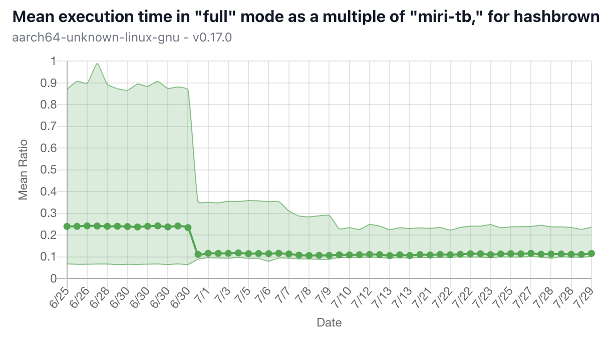
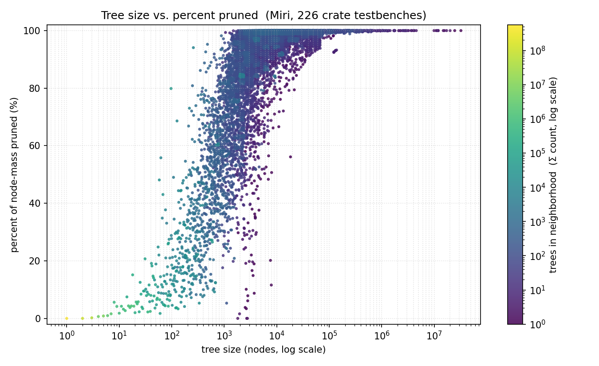
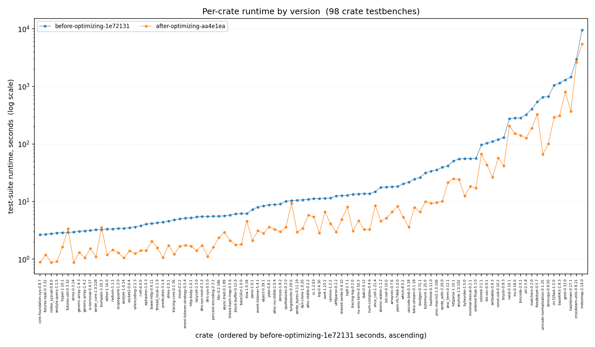

# Status Update - July 2026

#### By Molly MacLaren and Ian McCormack

We are building BorrowSanitizer: an LLVM-based instrumentation tool for finding violations of Rust’s aliasing model in multilanguage applications. If you're new to the project, then we recommend checking out the [introduction](https://borrowsanitizer.com/intro.html) and our [first status update](https://borrowsanitizer.com/status/january_2026.html) before you continue.

This month, we:
* Optimized our garbage collector.
* Found new cross-language aliasing bugs.

### GC Optimizations

As we mentioned in our [last update](https://borrowsanitizer.com/status/june_2026.html), BorrowSanitizer has a garbage collector now! If you take a look at our [performance dashboard](https://borrowsanitizer.github.io/bsan/), it should be pretty clear when we merged this feature:



We enabled Miri's garbage collector in our benchmarks at the same time, and our relative performance was still better!

Our garbage collector uses a combination of reference counting and stack-scanning. This means that we need a heuristic to determine how often we "stop the world" to collect garbage. If the collector runs too frequently, then it will hurt performance. If it rarely runs at all, then we will not see any benefit.

At first, we ran the collector after every 1000 retags. However, we were able to find a better solution by studying Miri's performance on a variety of crates.  
#### Node-visit based intervals of activation:

Our GC initially ran by counting new nodes created by retags since the last pass. Rather than base how often the GC activates on how much trees have grown, we switched to a more nuanced metric: node visits.

Every time a read, write, or retag occurs, a visitor pattern traverses the tree to update nodes' permission states. By keeping a relative count of visits between each GC pass, we can more accurately observe how many nodes are currently in use.

Why use a heuristic based on live nodes rather than dead? It is a *garbage* collector after all. As we mentioned in our [May status update](https://borrowsanitizer.com/status/may_2026.html), reducing node visits during each update to the tree can have huge time-saving impacts. If nodes in tall trees are frequently accessed, we want to compact the tree as much as possible to avoid unnecessary traversal and updates to dead nodes.

#### Compacting nodes with multiple children:

We previously did not remove nodes with more than one child. Removing nodes with a single child is fairly simple; ensure that the child node replacing it cannot become more permissive, or else we'll miss out on reporting undefined behavior. It turns out that multi-child compaction can be done soundly with one caveat: loss of information inherent in the trees' branching structure.

Particularly, replacing a node with one or more child nodes at the most permissive state, `ReservedIM`, can cause us to under-report UB even if the initial node is `ReservedIM`. This is because it's the only state that doesn't transition to `Disabled` during foreign writes (e.g., writes from sibling nodes). Replacing a parent with multiple siblings can cause one or more siblings to become more permissive than the replaced parent after sibling writes. Thus, we disallow compacting any `ReservedIM` child nodes during multi-child compaction.

This is the only case we need to exclude! In fact, we've witnessed multi-child compaction to compact *too well*: iterating over nodes with tens of thousands of live children every GC pass is extremely slow. Therefore, we bound compaction at a maximum of 16 child nodes, so that the check itself doesn't take longer than the time saved by compacting.

#### Threshold for tree sizes to be compacted:

Before optimizing BorrowSanitizer, we found it informative to see how Miri's GC works via profiling tree and node events. After running Miri on the testbenches from the top 500 most downloaded crates on crates.io and filtering for `unsafe` use, we observed the following S-curve across 226 testbenches in aggregate:



From this graph, we can see 99% of nodes from trees above 100k are pruned by the end of execution, further motivating the need to run the GC as often as reasonably necessary. On the low end of the curve, trees below 100 nodes are pruned by less than 25%. Given that these trees are barely pruned, we can skip compaction and its expensive permission checks entirely, speeding up our GC pass with little-to-no cost to overall runtime, where our real cost is in the large trees.

#### Results
The results of these optimizations have drastically improved BorrowSanitizer's runtime, even within the time since we've added garbage collection. Between right before implementing the first optimization and the latest commit, we saw a total mean speedup of **1.90x** (131.9s down to 62.4s) and a geometric mean speedup of **2.74x** (18.8s to 6.6s) across 98 of the top unsafe crate testbenches where BorrowSanitizer executes at least one test case!



Below 3s, there is likely noise in the sample. We'll update this graph to cover multiple runs within the next 24 hours.

### New Aliasing Bugs

We also found a couple of new cross-language aliasing bugs! None of these could have been detected by Miri, since they are triggered by operations that occur in C and C++.

#### Servo (mozjs)

Back in May, [@jdm](https://github.com/jdm) from the Servo Project reached out to us about replicating an aliasing bug that caused a panic in Servo's Rust encapsulation (see [#688](https://github.com/servo/mozjs/pull/688)). This month, we recreated the bug, and we found a new one in the latest version of `mozjs`!

The new bug was triggered by the following aliasing pattern:
```rust
let autoGCRooters: *mut _ = {
  let rooting_cx = cx as *mut JS::RootingContext;
  &mut (*rooting_cx).autoGCRooters_.0[self.kind_ as usize]
};
```
The raw pointer `autoGCRooters` is derived from a mutable reference, so it needs to have unique ownership for its lifetime. However, the C++ side was able to write to the same allocation, invalidating the pointer and triggering an aliasing violation the next time it was used in Rust. We reported this in [#781](https://github.com/servo/mozjs/issues/781) and fixed it in [#782](https://github.com/servo/mozjs/pull/782). The fix avoids asserting ownership by using `&raw mut` instead of `&mut`, which creates the same pointer without asserting ownership.

#### Fiona

Soon afterward, [@cmazakas](https://github.com/cmazakas) pointed us toward `fiona-rs`, a new encapsulation for the `io_uring` system call interface. We were able to find a similar cross-language aliasing bug:
```Rust
impl Executor {
    fn ring(&self) -> *mut io_uring {
        &raw mut *self.p.ioring.borrow_mut()
    }
}
```
The function `Executor::ring` returns a raw pointer derived from the mutable reference returned by `borrow_mut()`. Elsewhere, the Rust encapsulation writes to the same allocation using a different pointer, invalidating the first one. Across the foreign boundary in C, the invalid pointer was used for a read access, triggering undefined behavior. This was reported in [#3](https://github.com/cmazakas/fiona-rs/issues/3) and fixed in [#4](https://github.com/cmazakas/fiona-rs/pull/4), by using `as_ptr()` instead of `borrow_mut()`.

These errors demontrate that it is easy to accidentally cause aliasing violations in multilanguage libraries. Patterns that Rust encourages in safe contexts can become subtle sources of undefined behavior when pointers are shared across foreign boundaries. 

### Conclusion
That's all for now! In the coming weeks, we will be developing more dynamic and static optimizations, and preparing our talk for RustConf in September. You can reach our team [on Zulip](https://bsan.zulipchat.com/).
