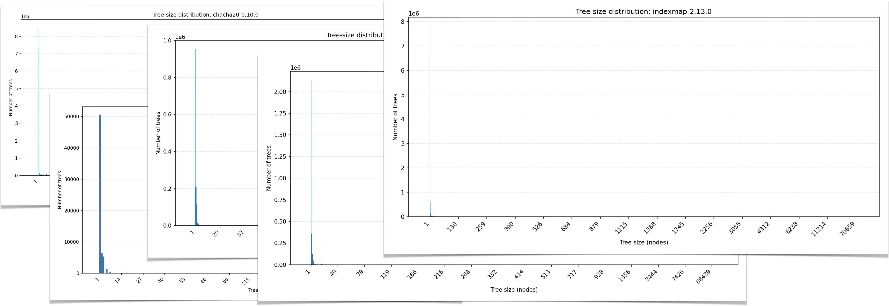
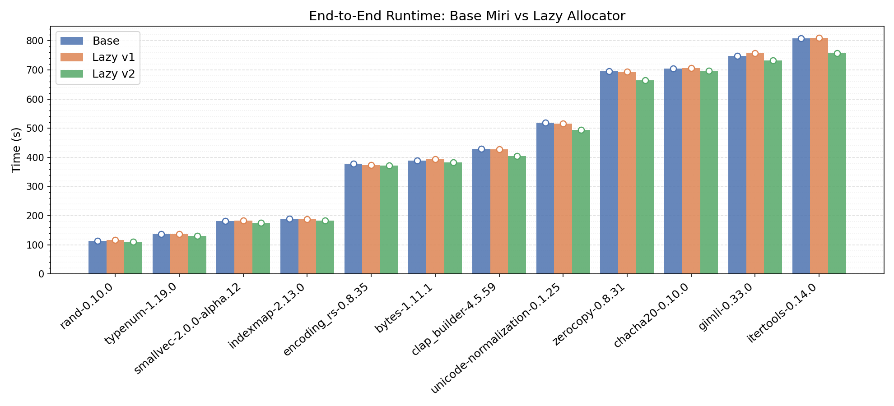

# Status Update - May 2026

### By: Molly MacLaren, Ian McCormack, Shinhae Kim, and Joshua Sunshine

We are building BorrowSanitizer: an LLVM-based instrumentation tool for finding violations of Rust’s aliasing model in multilanguage applications. If you are new to the project, we recommend checking out the [introduction](https://borrowsanitizer.com/intro.html) and our [first status update](https://borrowsanitizer.com/status/january_2026.html) before continuing.

This month we made progress in several areas which include: 
- Added more tests and tools for checking progress of tests that don't pass yet.
- Began testing our "no-op" LLVM wrapper mode with a new benchmarking pipeline and [dashboard](https://borrowsanitizer.github.io/bsan/).
- Designed and tested optimizations to Miri's Tree Borrows model that can be used in BorrowSanitizer.
- Posted [the RFC](https://discourse.llvm.org/t/rfc-experimental-support-for-borrowsanitizer/90938) for our LLVM components.

## Testing Progress

In [March](https://borrowsanitizer.com/status/march_2026.html#miris-test-suite), our test suite grew to 405 tests, after importing 323 more from Miri. At the time, we were passing 80% of them with correct behavior. This number has since then risen to 85%. In addition to that initial corpus, we've been continuously adding more tests. We can now replicate most of the cross-language Tree Borrows errors that we discovered our previous work with [MiriLLI](https://dl.acm.org/doi/10.1109/ICSE55347.2025.00167).

To track our progress in accepting new test cases, we added two new commands to our build script, `xb`. You can run `xb stats` and `xb fix`. The first command prints out a breakdown of the test suite, indicating which tests exhibit correct behavior and which tests are still false positives/negatives. The second command provides diagnostics on the remaining, incorrectly behaving tests, so that we can validate them before including them in the main test suite for CI.

Of the remaining 49 false negatives—tests that *should* produce correct diagnostics but do not—nearly all involve Miri's semantics for integer to pointer conversion ("wildcard" provenance). After updating our Tree Borrows runtime module to be closer to the latest version in Miri, we only need to track which allocations are "exposed" by integer-to-pointer conversion and update our LLVM pass to handle these cases. The handful of test cases that we have yet to support involve [SIMD](https://github.com/BorrowSanitizer/bsan/blob/main/tests/miri-tests/should-fail/baseline/intrinsics/simd-gather.rs), [thread-local allocation](https://github.com/BorrowSanitizer/bsan/blob/main/tests/miri-tests/should-fail/baseline/tls/tls_static_dealloc.rs), [environment variables](https://github.com/BorrowSanitizer/bsan/blob/main/tests/miri-tests/should-fail/baseline/environ-gets-deallocated.rs), and [variadics](https://github.com/BorrowSanitizer/bsan/blob/main/tests/miri-tests/should-pass/c-variadic.rs).

## "No-op" Mode
In addition to Miri's test cases, we also expanded our testing of BorrowSanitizer's LLVM pass and sanitizer runtime. We created [a new benchmarking dashboard](https://borrowsanitizer.github.io/bsan/) that tracks the performance of our no-op mode, which inserts our run-time checks, but skips executing most of our instrumentation. To recap, BorrowSanitizer has four primary components:

1. An experimental `-Zcodegen-emit-retag` flag within the Rust compiler
2. An LLVM instrumentation pass, which inserts BorrowSanitizer's runtime checks. 
3. An LLVM "wrapper" sanitizer runtime.
4. A Rust "core" runtime.

Our no-op mode uses just the second and third components. 

Component #1 is now making its way upstream (see [#156208](https://github.com/rust-lang/rust/pull/156208) and [#156210](https://github.com/rust-lang/rust/pull/156210)). The remaining components will need to be split across the Rust and LLVM toolchains. However, we need to be able to test the LLVM components as an independent unit, since the LLVM Project has no mechanism for supporting Rust dependencies. Our solution to this is to declare "weak" symbols within the LLVM wrapper for the APIs within the core. This allows us to test the LLVM components in a sort of "no-op" mode. Our runtime-checks are being inserted, but they are not going to report any errors.

We created [a benchmarking dashboard](https://borrowsanitizer.github.io/bsan/) to track the performance of this mode (and others, in the future). We report BorrowSanitizer's no-op execution time relative to 
uninstrumented native execution for a configurable list of crates, on each of our supported architectures. This started as a project by one of our undergrad research assistants, [Rafayel](https://www.linkedin.com/in/rafayelo/).

At the moment, BorrowSanitizer's *median* execution time is hovering around 6x slower than native execution in its no-op mode, for both hashbrown and indexmap. This initial baseline is useful for day-to-day development, but it is not a scientifically rigorous result; it does not account for outliers and varies significantly based on which machine is being used. It's also higher than established sanitizers—especially since the no-op mode removes the majority of shadow memory updates.

However, this represents our tool prior to any static optimization. We are in the early stages of profiling the LLVM wrapper, and we currently instrument everything by default, including stack allocations that are provably safe and never retagged. Crucially, even without these optimizations, our fully instrumented mode (which links the core runtime) remains within the same performance category as Miri (see our [Feburary status update](https://borrowsanitizer.com/status/february_2026.html#performance)), giving us a strong foundation to build upon. 

You can expect to see even more detailed statistics as this project continues. 

## Optimizing Miri... and soon Borrow Sanitizer!

To better understand what we're up against in terms of runtime overhead, we've been collaborating with [Shinhae Kim](https://shinhae-kim.github.io/) at Cornell (advised by [Saikat Dutta](https://www.cs.cornell.edu/~saikatd/) and [Owolabi Legunsen](https://www.cs.cornell.edu/~legunsen/)) on profiling and optimizing Miri, a more mature tool and the first to implement Tree Borrows. With Miri's relative stability (compared to BorrowSanitizer), we have been able to profile hundreds of the most used crates on [crates.io](https://crates.io/). We are focusing this effort entirely on the Tree Borrows implementation, so that the optimizations we discover can  translate to BorrowSanitizer.

Why should we care about optimization already? As it turns out, Tree Borrows can be quite slow in many cases. In the wild, users of Miri have reported up to [7,000x](https://medium.com/source-and-buggy/data-driven-performance-optimization-with-rust-and-miri-70cb6dde0d35) runtime overhead compared to native execution. For the popular crate [aho-corasick](https://crates.io/crates/aho-corasick), which runs its testbench in 2.2s natively, we found that it took 6,879s (~2h) to execute in Miri without borrow tracking and 73,824s (~20h) with Tree Borrows enabled. That's an overhead of nearly **35,000x**!

By profiling every tree event in Miri's runtime, we noticed a distinct pattern across each crate we analyzed: the vast majority of trees (74% on average) do not grow beyond a single node!

The memory allocations of these single node trees can *never* experience aliasing violations until they are first aliased by a child node, and thus the lone node remains stuck at the `Unique` permission state.

We can prevent creating these "stumps" entirely with a simple optimization we call **lazy allocation**: rather than create a tree for every allocation, hold on to the initialization parameters until the first `new_child` call. Right before the tree grows from one to two nodes, that's when it gets initialized.

This optimization passes Miri's entire testbench. In addition, in a sample of 12 crates with runtime overheads above 100x, we found an up to 6.7% speedup in Miri's runtime. Lazy v1 conservatively initializes the tree after *any* Tree method call, while Lazy v2 waits until the first child node is created, as described above. In Lazy v2, *every* crate in our sample experienced a speedup compared to the original, base Miri!

While the current time-saving benefits are modest, we expect this optimization to drastically reduce noise for a smart garbage collector tuned to run on Tree Borrows metrics. To clean up useless nodes, Miri uses a [mark-and-sweep](https://en.wikipedia.org/wiki/Tracing_garbage_collection#Naive_mark-and-sweep) GC algorithm that activates dependent on the number of basic blocks executed. However, different programs utilize Tree Borrows differently at different points of execution. We've found that this metric is not "one size fits all" for knowing when to prune nodes across crates and test cases.

If we decide when to run the GC based on a count of visited nodes since the last pass instead of the number of basic blocks we have executed, then we can prune trees at the intervals when they need it the most. Now that we have removed single-node stumps, this heuristic represents a cleaner metric of how much the larger trees—doing most of the heavy lifting—have grown since the last GC pass.

By setting the GC frequency to visit count with lazy allocation, we've seen an up to **171.3% speedup** (63% time reduction) in crate runtime compared to base Miri! With the same settings, other crates experience an increase in runtime. We're still working on more profiling to answer why this is and to calculate the most optimal heuristic.

How are we getting this huge speedup just from a smarter GC? A tree can grow via a retag, which is the most expensive Tree Borrows operation. Within trees that contain permission state transitions—the heavy lifters—the majority of retagging overhead lies in node visits during tree traversal. Garbage collection can prevent visiting useless nodes by pruning leaves and even reducing tree height by asking, "can this node be replaced by its child?" As a result, GCing can greatly reduce visiting time later on, but must be balanced with the time cost of running the GC itself.

What does this mean for BorrowSanitizer? These profiling insights from Miri directly inform the architecture of BorrowSanitizer. Once we identify the optimal GC heuristic within Miri, we plan to apply a similar node-count metric to the deferral portion of BorrowSanitizer’s upcoming deferred reference counting GC. Utilizing Miri's stable environment allows us to model and validate these garbage collection strategies before implementing them in our LLVM runtime.

## Conclusion
That's all for this month. If you have any questions, please reach out to us on [Zulip](https://bsan.zulipchat.com/).